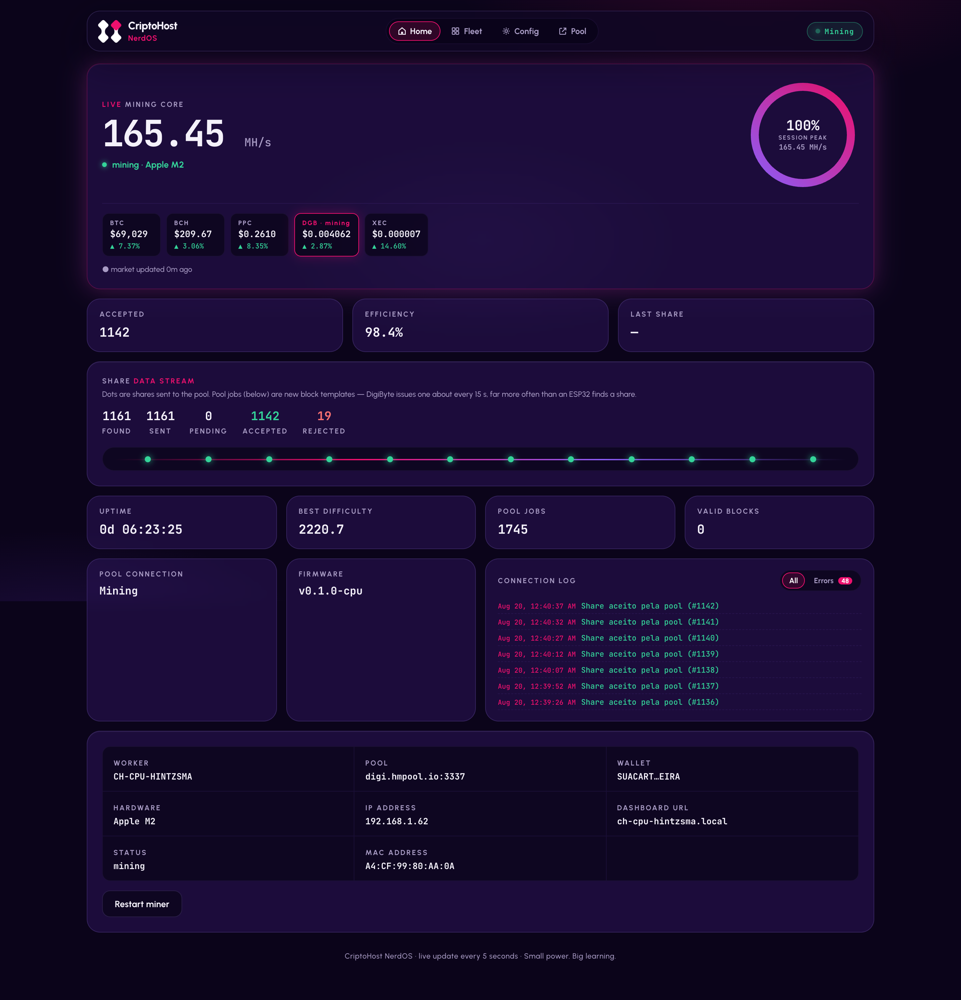
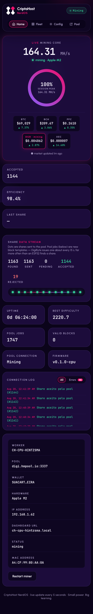
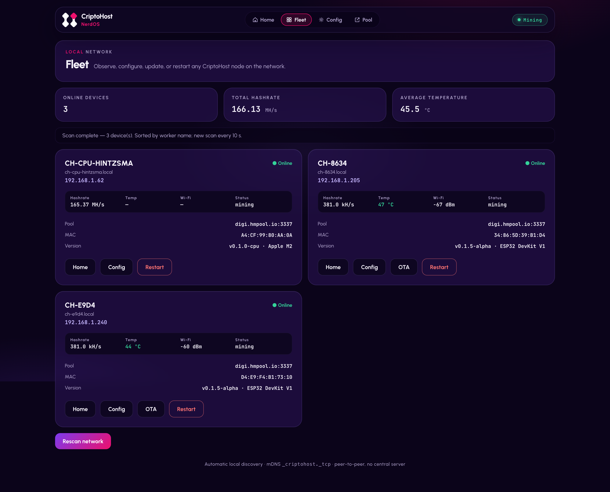
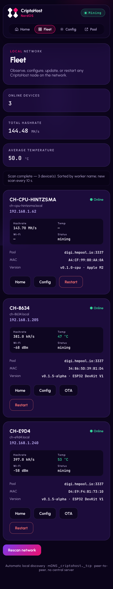
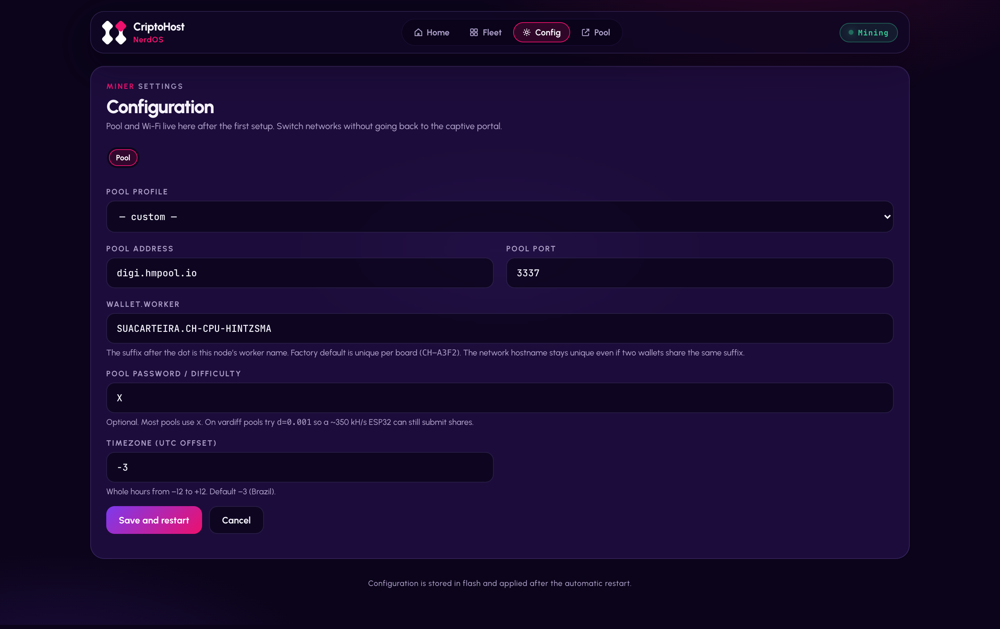
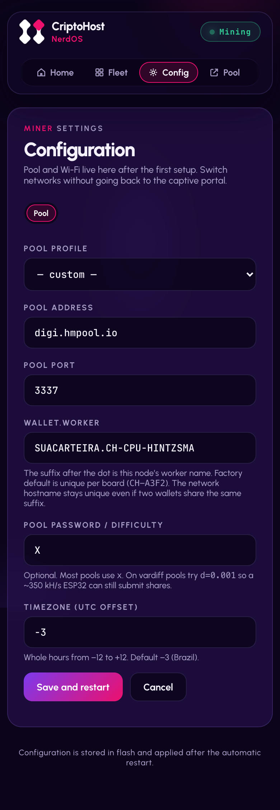

<div align="center">

# ⛏️ CriptoHost CPUMiner

**The computer you already own — Windows, Linux or Mac — mining SHA-256 on the same fleet as your boards.**

[🇧🇷 Português](README.md) · 🇺🇸 English

[](COPYING)
[](https://github.com/JayDDee/cpuminer-opt)

*A [Cripto Host](https://cripto.host) product — "Mining made easy"*

</div>

---

## 🧭 What is this?

CriptoHost CPUMiner is the desktop sibling of [CriptoHost NerdOS](https://github.com/criptohost/criptohost_nerdos): a **CLI SHA-256d CPU miner** for Windows, Linux and macOS, with an interactive menu, the **same web dashboard** as the ESP32 boards, and automatic Fleet integration. A fork of JayDDee's [cpuminer-opt](https://github.com/JayDDee/cpuminer-opt) — the fastest CPU miner in its class (SHA-NI on x86, ARMv8 SHA2/NEON on ARM).

> ⚠️ **Honest framing**: hobby and education. An Apple M2 does ~165 MH/s; an ASIC does 200 TH/s — 1.2 million times more. The miner's own log estimates ~3,400 years to solo-find a DGB block. The value is learning Stratum, vardiff and CPU optimization while watching shares get accepted within seconds.

## ✨ What it does

- 🖥️ **Multi-platform** — Windows, Linux, macOS (Intel and Apple Silicon), even [Android](https://github.com/criptohost/criptohost_mobile)
- ⚡ **Your CPU's fast path** — SHA-NI/AVX2 on x86, ARMv8 crypto on Apple Silicon and ARM — auto-detected
- 🧙 **Interactive CLI** — menu for wallet, pool, worker, threads and password, with persistence (`./ch/mine.sh`)
- 📊 **Same dashboard as the boards** — the CH Agent serves the UI on port 8091: hashrate, shares, best difficulty, error log with real reject reasons
- 🕸️ **Joins the Fleet automatically** — mDNS `_criptohost._tcp`; no multicast (datacenter/Android)? static peers by IP
- 🔁 **Supervision** — the agent restarts the miner if it dies and logs why

## 🖼️ Screens

Real captures from an Apple M2 mining at ~165 MH/s, with the Fleet showing ESP32 boards and an Android phone.

| | Desktop | Mobile |
|---|---|---|
| **Home** |  |  |
| **Fleet** |  |  |
| **Config** |  |  |

## 🚀 Up and running in 5 minutes

**You'll need:** a computer and a wallet for the coin (DigiByte recommended).

### 🍎 macOS

```bash
xcode-select --install
brew install autoconf automake jansson openssl@3 curl
git clone https://github.com/criptohost/criptohost_cpuminer && cd criptohost_cpuminer
./ch/build-macos.sh
./ch/mine.sh
```

### 🐧 Linux (Debian/Ubuntu)

```bash
sudo apt-get update && sudo apt-get install -y build-essential automake libssl-dev libcurl4-openssl-dev libjansson-dev libgmp-dev zlib1g-dev
git clone https://github.com/criptohost/criptohost_cpuminer && cd criptohost_cpuminer
./ch/build-linux.sh
./ch/mine.sh
```

### 🤖 Android (Termux, no app store)

```bash
curl -fsSL https://raw.githubusercontent.com/criptohost/criptohost_mobile/main/setup-termux.sh | bash
```

### 🪟 Windows

Use the prebuilt executables from the [upstream Releases](https://github.com/JayDDee/cpuminer-opt/releases) with our profiles (`cpuminer-avx2-sha.exe -c ch\conf\dgb-hmpool.json`), or build via MSYS2 (`INSTALL_WINDOWS`).

### The menu

```
 CriptoHost CPUMiner — configuration
 ──────────────────────────────────────
  [1] Start mining (terminal only)
  [2] Start with web dashboard (CH Agent)   ← recommended
  [3] Wallet   [4] Pool   [5] Worker   [6] Threads   [7] Password
```

Pick **[2]**, open `http://localhost:8091` and watch the shares land. 🎉

## 🕸️ The fleet (and its siblings)

The CH Agent makes your PC speak the CriptoHost contract (`_criptohost._tcp` + `GET /api/status`) — it shows up on the boards' Fleet and the boards show up on its own.

| Repository | What it mines | Typical hashrate |
|---|---|---|
| [criptohost_nerdos](https://github.com/criptohost/criptohost_nerdos) | ESP32 (DevKit V1, S3, T-Display) | ~350 kH/s |
| **criptohost_cpuminer** (this one) | Windows, Linux and macOS (CPU) | 20–165 MH/s |
| [criptohost_mobile](https://github.com/criptohost/criptohost_mobile) | Android via Termux (iOS = panel) | ~47 MH/s |

**Networks without mDNS** (datacenter, Android): copy `ch/peers.conf.example` to `ch/peers.conf` with one `ip[:port]` per line — the Fleet merges those nodes with the discovered ones.

## 🔌 API

Two layers: the native cpuminer API (`127.0.0.1:4048`, `KEY=VAL` format) and the **CH Agent** translating it into the ecosystem contract:

```bash
curl http://localhost:8091/api/status   # same JSON as the ESP32 boards
```

The agent also extracts from the miner log what the native API doesn't expose: best difficulty, pool jobs and reject reasons (the dashboard's Errors tab).

## ⛏️ Pools and coins

Default: **DigiByte on hmpool** (`digi.hmpool.io:3337`, password `X`). Ready-made profiles in `ch/conf/`: DGB, BTC (lottery), XEC, BCH. Vardiff tip: the pool tunes difficulty to ~1 share/30 s per worker — a fast PC gets "heavier" shares, not more shares; **PPLNS credits difficulty × shares**, so nothing is lost.

## ❓ Honest questions

**Will I make money?** No — see the framing above. **Can I run it on a production server?** Yes, but cap the threads (`[6]` in the menu) to leave CPU for your workload. **My antivirus flagged it.** Classic miner false-positive; the code is open for audit (note inherited from upstream).

## 🧑‍💻 For developers

- `ch/` is the Cripto Host layer (menu, agent, profiles, builds); the upstream mining core stays intact — minimal patches documented in commits (two are upstream-PR candidates: a Clang/C23 build fix and a buffer overflow in `api.c`).
- Branch `main` = CH layer · branch `upstream` = clean cpuminer-opt mirror for rebasing.
- Dashboard: mirror of `criptohost_nerdos/data` in `ch/agent/web/` — sync with `./ch/agent/sync-web.sh`.

## 📜 License, trademark and credits

- **Code**: [GPL-2.0](COPYING), inherited from [cpuminer-opt](https://github.com/JayDDee/cpuminer-opt) — full credit to JayDDee and the historical authors (pooler, tpruvot, Jeff Garzik et al.). The upstream's BTC donation address remains in the non-CH banner.
- **Trademark**: free code, protected brand — see the ecosystem's [BRANDING.md](https://github.com/criptohost/criptohost_nerdos/blob/main/BRANDING.md).

## 💬 Contact

Questions, ideas or partnerships: **fale@cripto.host** · Issues and PRs welcome.

---

<div align="center">

*Small power. Big learning.* 💜

</div>
